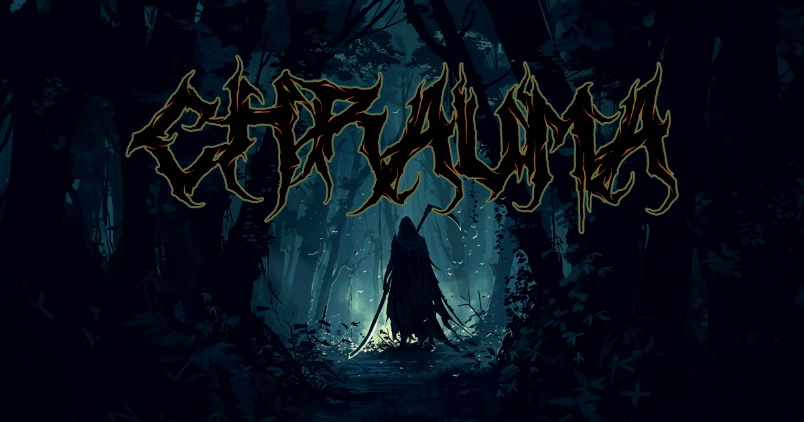
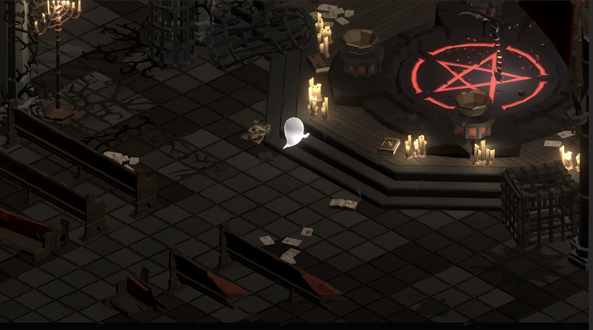
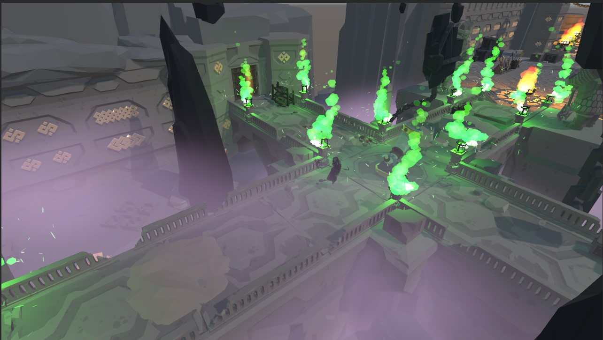

# 

## Overview
Chrauma is an action RPG set in an isometric 3D world that lacks colors. Designed for those who love engaging and fun-filled games, Chrauma aims to solve the problem of boredom with an immersive gaming experience.

## Availability
- **Platforms**: Windows, Mac
- **Build**: Available on GitHub (link to be provided)
- **Website**: TBA

-----

  
  

-----

## Team
- [**Thomas Viard**](https://github.com/ThomasVrd11) - Lead Developer / Game Designer / Game Programmer
- [**François Colas**](https://github.com/fgmcolas) - Lead Developer / Web Developer / Data Engineer
- [**Nicolas Taillepierre**](https://github.com/TaillepierreN) - Lead Developer / Game Programmer / Game Designer

## Technologies
### Website
- **Primary**: HTML, CSS, JS (Node.js, MongoDB)
- **Alternative**: Django, MySQL
  - **Tradeoff**: Using Python instead of JavaScript

### Game Development
- **Primary**: C#, Unity
- **Alternative**: Unreal Engine, Godot
  - **Tradeoff**: Unity is easier to learn and more familiar to the team

## Challenges and Solutions
### Technical Challenges
1. **Animation Handling**
   - **Problem**: Difficulty in creating or modifying animations
   - **Solution**: Learn animation techniques or adapt existing animations

2. **Isometric View Issues**
   - **Problem**: Unity's handling of position, direction, and angles in isometric view
   - **Solution**: Use mathematical adjustments

### Non-Technical Challenges
1. **Asset Acquisition**
   - **Problem**: Difficulty in finding coherent artistic assets
   - **Solution**: Continue searching for assets or rework existing models

## Infrastructure
We are using a [sandbox Git repository](https://github.com/ThomasVrd11/SandBox_Portfolio) for learning and experimentation with different techniques and styles of coding and animation. Unity's package system allows us to transfer specific game objects or scripts between projects, enabling us to build functioning components in the sandbox and adapt them in the main project.

### Development Workflow
- **Unity Play Mode**: Used for testing and debugging, with regular builds for specific tests
- **Live Server**: Used for real-time display of website changes and tweaking via the inspector

## Inspirations
### Hades
### Death's Door
### Cocoon
among others

## Roles and Collaboration
Art direction, graphic style, and gameplay elements are collaboratively discussed among the team. All opinions are considered, with feasibility being a key factor. François focuses on the web aspect due to his expertise, while Thomas and Nicolas focus on Unity development.

### Communication
- **Regular Updates**: Team members post videos or stream their progress on our Discord server for feedback and assistance.

## Deployment
The game will be built for Windows and Mac, with a potential WebGL version if time permits.

---

# Contact
For any questions or feedback, feel free to reach out to Thomas Viard.
